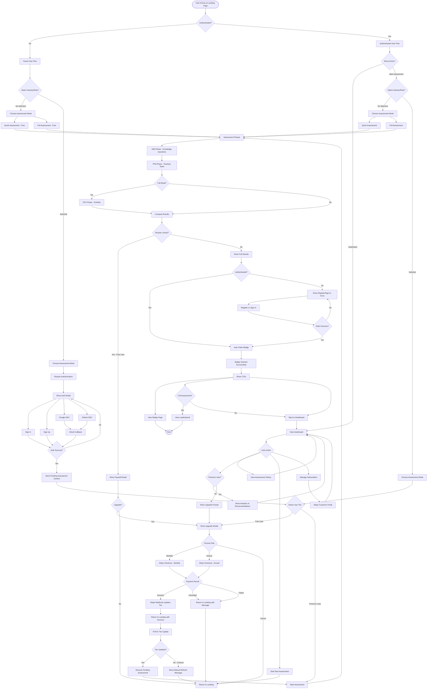

# PromptRanks User Conversion Journey

## Overview
This document describes the complete user journey through the PromptRanks assessment platform, covering authentication, payment, assessment flows, and post-assessment actions.

## Business Logic Flow Diagram

## Detailed Use Cases

### Use Case 1: New Visitor - No Industry/Role Selection - Quick Assessment

**Flow:**
1. User arrives at landing page (unauthenticated)
2. User does NOT select industry or role
3. User clicks "Quick Assessment"
4. System starts free quick assessment immediately
5. User completes KBA phase
6. User completes PPA phase
7. System computes results and shows full results page
8. User sees register/sign-in form to claim badge
9. User registers or signs in
10. System auto-claims badge
11. User sees badge with CTAs: "View Badge" and "Back to Dashboard"

**Key Points:**
- No authentication required to start
- No premium gating (no industry/role selected)
- Badge claim requires authentication
- After claim, user is authenticated and can access dashboard

---

### Use Case 2: Visitor - Industry/Role Selected - Quick Assessment

**Flow:**
1. User arrives at landing page (unauthenticated)
2. User selects industry and/or role from dropdowns
3. User clicks "Quick Assessment"
4. System detects premium taxonomy selection
5. System shows authentication modal
6. User signs in via password, Google SSO, or GitHub SSO
7. System stores pending assessment context in sessionStorage:
   - `auth_intent: 'premium_assessment'`
   - `pending_premium_assessment: {mode: 'quick', industryId, roleId}`
8. After successful auth, system checks user tier
9. **If Free User:**
   - System shows upgrade modal with monthly/annual options
   - User selects plan and proceeds to Stripe Checkout
   - After successful payment, Stripe webhook updates user tier to "premium"
   - User returns to landing page with `?checkout=success&session_id=...`
   - System polls for tier update (up to 6 attempts, 1.5s intervals)
   - Once tier is premium, system resumes pending assessment
   - System starts quick assessment with exact industry/role
10. **If Premium User:**
    - System immediately starts quick assessment with industry/role
11. User completes assessment phases
12. System auto-claims badge (user is authenticated)
13. User sees badge with CTAs

**Key Points:**
- Industry/role selection triggers premium gating
- Authentication required before tier check
- Pending assessment context preserved across auth and payment
- System automatically resumes after successful upgrade
- No manual re-selection needed

---

### Use Case 3: Visitor - No Industry/Role Selection - Full Assessment

**Flow:**
1. User arrives at landing page (unauthenticated)
2. User does NOT select industry or role
3. User clicks "Full Assessment"
4. System starts free full assessment immediately
5. User completes KBA phase
6. User completes PPA phase
7. User completes PSV phase (portfolio)
8. System computes results
9. **Results are locked** (full assessments require premium to view results)
10. System shows paywall modal: "Upgrade to Premium to unlock your full assessment results"
11. User clicks upgrade
12. System shows upgrade modal
13. User proceeds through payment flow
14. After successful payment and tier update, user can view results
15. System auto-claims badge
16. User sees badge with CTAs: "View Badge", "View Leaderboard", "Back to Dashboard"

**Key Points:**
- Full assessment can be started without auth
- Results are locked for free users
- Paywall appears after assessment completion
- Leaderboard CTA only appears for full assessments

---

### Use Case 4: Visitor - Industry/Role Selected - Full Assessment

**Flow:**
1. User arrives at landing page (unauthenticated)
2. User selects industry and/or role
3. User clicks "Full Assessment"
4. System shows authentication modal (premium taxonomy selected)
5. User authenticates
6. System stores pending assessment: `{mode: 'full', industryId, roleId}`
7. System checks user tier
8. **If Free User:**
   - Shows upgrade modal
   - User completes payment
   - System resumes pending full assessment with industry/role
9. **If Premium User:**
   - Starts full assessment immediately with industry/role
10. User completes all three phases (KBA, PPA, PSV)
11. System shows full results (not locked for premium users)
12. System auto-claims badge
13. User sees badge with CTAs including "View Leaderboard"

**Key Points:**
- Combines premium taxonomy gating with full assessment
- Both gates must be satisfied before starting
- Results are unlocked for premium users
- Full assessment includes leaderboard access

---

### Use Case 5: Payment Gateway Flows

#### Successful Payment
1. User clicks upgrade from modal
2. User selects monthly or annual plan
3. System stores plan selection in sessionStorage
4. System redirects to Stripe Checkout
5. User completes payment with test card (sandbox)
6. Stripe sends webhook to `/payments/webhook`
7. Webhook handler updates `users.subscription_tier = 'premium'`
8. Stripe redirects user to `/?checkout=success&session_id=...`
9. Landing page shows: "Payment successful! Verifying your premium access..."
10. System polls `/dashboard` endpoint for tier update
11. Once tier is premium, system clears checkout params and resumes pending assessment

#### Cancelled Payment
1. User clicks upgrade
2. User selects plan
3. System redirects to Stripe Checkout
4. User clicks "Back" or closes Stripe page
5. Stripe redirects to `/?checkout=cancelled`
6. Landing page shows: "Payment was cancelled. You can try again anytime."
7. Message auto-dismisses after 5 seconds
8. Pending assessment context remains in sessionStorage
9. User can retry upgrade anytime

#### Failed Payment
1. User enters invalid card details
2. Stripe shows error inline
3. User can retry or cancel
4. If cancelled, follows cancelled payment flow

**Key Points:**
- Webhook is the source of truth for tier updates
- Frontend polls to detect webhook completion
- Pending assessment context survives payment flow
- Clear user feedback for all payment states

---

### Use Case 6: Direct Sign-In/Sign-Up

#### Free User Direct Sign-In
1. User arrives at landing page
2. User clicks "Sign In" (if auth modal is available) or navigates to `/dashboard` directly
3. User signs in with password or OAuth
4. System redirects to `/dashboard`
5. Dashboard shows:
   - User email and tier badge (FREE)
   - Assessment CTA buttons: "Start Assessment", "Full Assessment"
   - Recent assessments (if any)
   - Upgrade prompt: "Unlock Analytics & Recommendations"
   - Subscription card showing "Free Plan"
6. User can:
   - Click "Start Assessment" → redirects to landing page
   - Click "Full Assessment" → redirects to landing with `?mode=full`
   - Click "Upgrade to Premium" → shows upgrade modal
   - View assessment history
   - Cannot see analytics (premium only)

#### Premium User Direct Sign-In
1. User arrives at landing page
2. User signs in
3. System redirects to `/dashboard`
4. Dashboard shows:
   - User email and tier badge (PREMIUM)
   - Assessment CTA buttons
   - Usage card: "X / 3 full assessments used this month"
   - Recent assessments
   - Analytics section: score trends, pillar comparison
   - Recommendations section: skill gaps and learning recommendations
   - Subscription card: "Premium Plan - $19/month" or "$190/year"
   - "Manage Subscription" button → Stripe Customer Portal
5. User can:
   - Start new assessments (with or without industry/role)
   - View full analytics and recommendations
   - Manage subscription via Stripe portal
   - View assessment history with full details

**Key Points:**
- Dashboard is the authenticated user home
- Free users see upgrade prompts
- Premium users see analytics and usage tracking
- Assessment CTAs route back to landing page
- Subscription management handled by Stripe portal

---

## Session Storage Keys

The system uses sessionStorage to maintain state across navigation:

| Key | Value | Purpose |
|-----|-------|---------|
| `auth_intent` | `'premium_assessment'` \| `'dashboard'` | Tracks why user authenticated |
| `pending_premium_assessment` | `{mode: 'quick'\|'full', industryId: string, roleId: string}` | Stores assessment to resume after upgrade |
| `pending_subscription_plan` | `'premium_monthly'` \| `'premium_annual'` | Tracks selected plan before Stripe redirect |
| `pending_subscription_upgrade` | `'true'` \| `'completed'` | Tracks upgrade flow state |
| `auth_token` | JWT string | Authentication token |
| `auth_user` | User object JSON | Cached user data |
| `oauth_provider` | `'google'` \| `'github'` | OAuth provider for callback |
| `assessment` | Assessment data JSON | Current assessment session |

---

## API Endpoints

### Authentication
- `POST /auth/register` - Register new user
- `POST /auth/login` - Password login
- `GET /auth/google` - Initiate Google OAuth
- `GET /auth/google/callback` - Google OAuth callback
- `GET /auth/github` - Initiate GitHub OAuth
- `GET /auth/github/callback` - GitHub OAuth callback

### Assessments
- `POST /assessments/start` - Start new assessment
- `GET /assessments/{id}/results` - Get assessment results
- `POST /assessments/{id}/claim` - Claim badge (with or without auth)

### Payments
- `POST /payments/create-checkout` - Create Stripe checkout session
- `POST /payments/create-portal` - Create Stripe customer portal session
- `POST /payments/webhook` - Stripe webhook handler
- `GET /payments/subscription` - Get current subscription

### Dashboard
- `GET /dashboard` - Get dashboard data (user, usage, recent assessments)
- `GET /usage/check` - Check user tier and usage limits

### Analytics (Premium Only)
- `GET /analytics/score-trend` - Score history over time
- `GET /analytics/pillar-comparison` - PECAM pillar breakdown
- `GET /analytics/skill-gaps` - Identified weak areas
- `GET /analytics/recommendations` - Learning recommendations

---

## Stripe Webhook Events

The system listens for these Stripe webhook events:

### `checkout.session.completed`
- Triggered when user completes payment
- Updates `users.subscription_tier = 'premium'`
- Updates `stripe_customers.stripe_subscription_id`
- Sends upgrade confirmation email
- Logs: "Webhook: Successfully updated user {email} to premium tier"

### `customer.subscription.deleted`
- Triggered when subscription is cancelled or expires
- Updates `users.subscription_tier = 'free'`
- Clears `stripe_customers.stripe_subscription_id`
- Logs: "Webhook: Subscription deleted for user {email}"

**Important:** Webhook must be configured in Stripe Dashboard with correct endpoint URL and signing secret.

---

## Error Handling

### Authentication Errors
- Invalid credentials → "Authentication failed"
- OAuth callback failure → Clears provider state, shows error
- Token expired → Redirects to login

### Payment Errors
- Missing Stripe config → "Stripe checkout is not configured correctly yet"
- Invalid plan selection → "Unsupported subscription plan"
- Webhook signature failure → Returns 400, logs error

### Assessment Errors
- Expired assessment → Shows "Assessment Expired" page
- Results locked → Shows paywall modal
- Claim failure → Shows error in claim form

### Tier Check Errors
- Usage limit exceeded → "You've reached your assessment limit"
- Free user with premium selection → Shows upgrade modal
- Unable to verify tier → "Unable to verify your subscription right now"

---

## Testing Checklist

### Authentication Flow
- [ ] Password sign-in works in one attempt
- [ ] Password sign-up works in one attempt
- [ ] Google SSO completes and lands on dashboard
- [ ] GitHub SSO completes and lands on dashboard
- [ ] OAuth callback preserves pending assessment context

### Payment Flow
- [ ] Upgrade modal shows monthly and annual options
- [ ] Monthly checkout opens Stripe with correct price
- [ ] Annual checkout opens Stripe with correct price
- [ ] Successful payment returns to landing with success message
- [ ] Cancelled payment returns to landing with cancelled message
- [ ] Webhook updates user tier to premium
- [ ] Dashboard polls and detects tier update

### Assessment Resume Flow
- [ ] Free user selects industry + quick → auth → upgrade → payment → resumes exact quick assessment
- [ ] Free user selects role + full → auth → upgrade → payment → resumes exact full assessment
- [ ] Premium user selects industry/role → starts assessment immediately
- [ ] No selection → starts free assessment immediately

### Results and Badge Flow
- [ ] Authenticated user completes assessment → badge auto-claimed
- [ ] Unauthenticated user completes assessment → shows register/sign-in form
- [ ] After claim, shows "View Badge" CTA
- [ ] Full assessment shows "View Leaderboard" CTA
- [ ] All assessments show "Back to Dashboard" CTA
- [ ] Free user full assessment → results locked → paywall shown

### Dashboard Flow
- [ ] Free user dashboard shows upgrade prompt
- [ ] Premium user dashboard shows analytics
- [ ] Assessment CTAs route to landing page
- [ ] Subscription card shows correct plan (monthly/annual)
- [ ] Manage subscription opens Stripe portal

---

## Known Limitations

1. **Webhook Dependency**: Subscription tier updates depend on Stripe webhook delivery. If webhook fails or is delayed, user may see stale tier status.

2. **Polling Timeout**: Dashboard polls for tier update 6 times (9 seconds total). If webhook hasn't fired by then, user sees manual refresh message.

3. **Session Storage**: Pending assessment context is stored in sessionStorage, which is cleared when browser tab closes. User must complete flow in same tab.

4. **Test Mode**: Stripe sandbox requires test card numbers. Real cards will fail in test mode.

5. **Email Delivery**: Upgrade confirmation emails depend on EmailService configuration. May not work in local development.

---

## Future Enhancements

1. **Webhook Retry**: Add exponential backoff retry for failed webhook processing
2. **Real-time Updates**: Use WebSocket or SSE for instant tier updates instead of polling
3. **Persistent State**: Move pending assessment to database instead of sessionStorage
4. **Payment Recovery**: Add UI to manually sync subscription status if webhook fails
5. **Multi-tab Support**: Sync authentication state across browser tabs
6. **Progressive Assessment**: Allow users to pause and resume assessments
7. **Social Sharing**: Add badge sharing to LinkedIn, Twitter, etc.
8. **Team Plans**: Support organization subscriptions with multiple users

---

## Conclusion

This document provides a comprehensive overview of the PromptRanks user conversion journey. The system is designed to:

- Minimize friction for free users
- Clearly communicate premium value
- Preserve user context across authentication and payment
- Provide immediate feedback at every step
- Handle edge cases gracefully

For implementation details, see the codebase at `/Volumes/DEV/Scopelabs.work/opensource/prk-poc/`.
