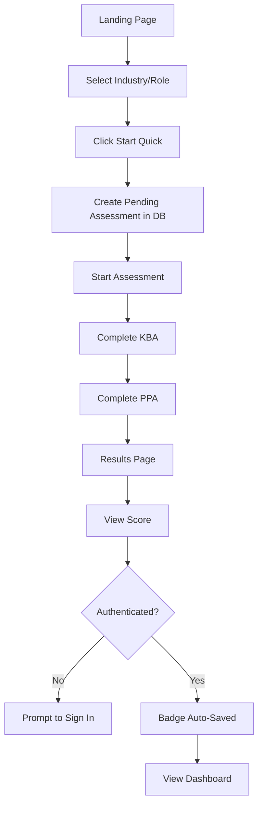
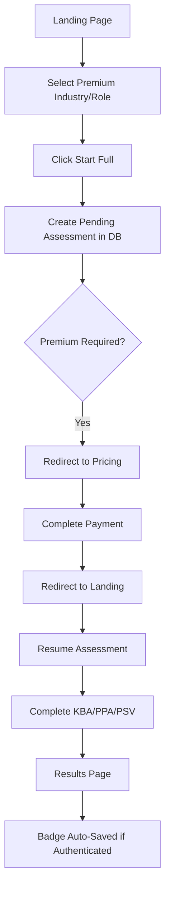
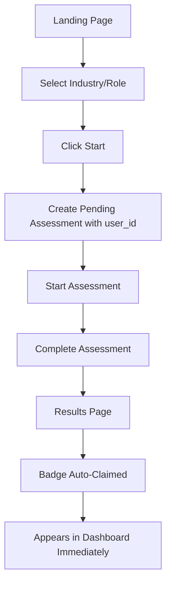

# Simplified User Conversion Journey - Phase 1

## Overview

This document outlines the Phase 1 simplification of the Promptranks user conversion flow. The goal is to reduce complexity from 7/10 to 5/10 by addressing three key areas:

1. **Database-backed state management** - Replace sessionStorage with database persistence
2. **Simplified premium gating** - Single decision point instead of multiple conditional checks
3. **Deferred badge claiming** - Lazy approach where badges appear automatically in dashboard

## Current vs Simplified Architecture

### Before (Current - Complexity 7/10)

**State Management:**
- Uses sessionStorage for pending assessment context
- State lost on browser close/refresh
- Complex synchronization between frontend and backend
- Multiple points where state can be lost

**Premium Gating:**
- Multiple conditional checks throughout the flow
- Complex logic in Landing.tsx, Assessment.tsx, PPA.tsx
- State preservation across Stripe redirect
- Polling for tier updates after payment

**Badge Claiming:**
- Immediate claiming required at Results page
- Authentication check at claim time
- Manual "Claim Badge" button for unauthenticated users
- Complex conditional rendering based on auth state

### After (Phase 1 - Complexity 5/10)

**State Management:**
- Database table: `pending_assessments`
- Persistent across sessions and devices
- Single source of truth
- Automatic cleanup after completion

**Premium Gating:**
- Single check at assessment start
- Clear decision: proceed or upgrade
- No mid-flow interruptions
- Simplified redirect flow

**Badge Claiming:**
- Automatic claiming when user signs in
- No manual claim button needed
- Badge appears in dashboard automatically
- Simplified Results page UI

## Database Schema Changes

### New Table: pending_assessments

```sql
CREATE TABLE pending_assessments (
    id UUID PRIMARY KEY DEFAULT gen_random_uuid(),
    user_id UUID REFERENCES users(id) ON DELETE CASCADE,
    session_id VARCHAR(255) NOT NULL,  -- For anonymous users
    industry VARCHAR(100) NOT NULL,
    role VARCHAR(100) NOT NULL,
    mode VARCHAR(20) NOT NULL,  -- 'quick' or 'full'
    status VARCHAR(20) DEFAULT 'pending',  -- 'pending', 'in_progress', 'completed', 'abandoned'
    assessment_id UUID REFERENCES assessments(id) ON DELETE SET NULL,
    created_at TIMESTAMP WITH TIME ZONE DEFAULT NOW(),
    updated_at TIMESTAMP WITH TIME ZONE DEFAULT NOW(),
    expires_at TIMESTAMP WITH TIME ZONE DEFAULT NOW() + INTERVAL '24 hours',

    UNIQUE(session_id)
);

CREATE INDEX idx_pending_assessments_user_id ON pending_assessments(user_id);
CREATE INDEX idx_pending_assessments_session_id ON pending_assessments(session_id);
CREATE INDEX idx_pending_assessments_expires_at ON pending_assessments(expires_at);
```

### Modified Table: assessments

```sql
-- Add column to track unclaimed badges
ALTER TABLE assessments ADD COLUMN badge_claimed BOOLEAN DEFAULT FALSE;
ALTER TABLE assessments ADD COLUMN badge_claimed_at TIMESTAMP WITH TIME ZONE;
```

## API Changes

### New Endpoints

**POST /api/assessments/pending**
- Create or update pending assessment
- Request body: `{ industry, role, mode, session_id?, user_id? }`
- Response: `{ id, industry, role, mode, status }`

**GET /api/assessments/pending/{session_id}**
- Retrieve pending assessment by session ID
- Response: `{ id, industry, role, mode, status, assessment_id? }`

**DELETE /api/assessments/pending/{id}**
- Cancel/abandon pending assessment
- Response: `{ success: true }`

**GET /api/dashboard/unclaimed-badges**
- Get list of unclaimed badges for authenticated user
- Response: `[{ assessment_id, badge_id, industry, role, score, completed_at }]`

### Modified Endpoints

**POST /api/assessments/start**
- Now checks for pending assessment
- Auto-resumes if pending assessment exists
- Premium check happens here (single point)

**POST /api/assessments/{id}/claim**
- Now sets `badge_claimed = true`
- Returns badge data as before

## Frontend Changes

### Landing.tsx

**Before:**
```typescript
// Complex sessionStorage management
const handleStart = () => {
  sessionStorage.setItem('pending_assessment', JSON.stringify({
    industry, role, mode
  }))
  if (requiresUpgrade) {
    // Redirect to payment
  } else {
    navigate('/assessment')
  }
}
```

**After:**
```typescript
// Simple API call
const handleStart = async () => {
  const sessionId = getOrCreateSessionId()

  // Create pending assessment
  await fetch('/api/assessments/pending', {
    method: 'POST',
    body: JSON.stringify({ industry, role, mode, session_id: sessionId })
  })

  // Single premium check
  if (requiresUpgrade) {
    navigate('/pricing')
  } else {
    navigate('/assessment')
  }
}
```

### Assessment.tsx

**Before:**
```typescript
// Check sessionStorage, check auth, check tier
useEffect(() => {
  const pending = sessionStorage.getItem('pending_assessment')
  if (!pending) navigate('/landing')

  const { industry, role } = JSON.parse(pending)
  if (requiresPremium(industry, role) && !isPremium) {
    // Show upgrade modal
  }
}, [])
```

**After:**
```typescript
// Single API call to start assessment
useEffect(() => {
  const startAssessment = async () => {
    const sessionId = getSessionId()
    const res = await fetch('/api/assessments/start', {
      method: 'POST',
      body: JSON.stringify({ session_id: sessionId })
    })

    if (res.status === 402) {
      // Payment required - redirect to pricing
      navigate('/pricing')
      return
    }

    const data = await res.json()
    setAssessmentId(data.assessment_id)
    // Continue with assessment
  }

  void startAssessment()
}, [])
```

### Results.tsx

**Before:**
```typescript
// Complex authentication check and manual claim
{isAuthenticated ? (
  <div>Badge auto-claimed</div>
) : (
  <button onClick={handleClaim}>Claim Badge</button>
)}
```

**After:**
```typescript
// Simple display, no claim button
<div>
  <h2>Assessment Complete!</h2>
  <p>Your score: {score}</p>
  {isAuthenticated ? (
    <p>Badge saved to your dashboard</p>
  ) : (
    <p>Sign in to save your badge and track progress</p>
  )}
  <button onClick={() => navigate('/dashboard')}>View Dashboard</button>
</div>
```

### Dashboard.tsx

**Before:**
```typescript
// Only shows claimed badges
const badges = await fetch('/api/badges')
```

**After:**
```typescript
// Shows all badges + auto-claim unclaimed ones
useEffect(() => {
  const claimPendingBadges = async () => {
    const unclaimed = await fetch('/api/dashboard/unclaimed-badges')

    // Auto-claim all unclaimed badges
    for (const badge of unclaimed.data) {
      await fetch(`/api/assessments/${badge.assessment_id}/claim`, {
        method: 'POST'
      })
    }

    // Refresh dashboard
    fetchDashboard()
  }

  void claimPendingBadges()
}, [])
```

## Simplified User Flows

### Flow 1: Anonymous User → Quick Assessment → Complete



### Flow 2: Anonymous User → Premium Assessment → Payment → Complete



### Flow 3: Authenticated User → Assessment → Auto-Badge



## Benefits of Phase 1 Simplification

### 1. Reduced Complexity
- **Before:** 7/10 - Multiple state management points, complex conditional logic
- **After:** 5/10 - Single source of truth, clear decision points

### 2. Better User Experience
- No lost progress on browser close
- Seamless resume across devices
- No manual badge claiming needed
- Clearer upgrade prompts

### 3. Easier Maintenance
- Single database table for state
- Fewer conditional branches
- Clearer separation of concerns
- Easier to debug and test

### 4. Better Reliability
- No sessionStorage limitations
- Persistent state across sessions
- Automatic cleanup of expired assessments
- Reduced race conditions

## Implementation Checklist

### Backend
- [ ] Create migration for `pending_assessments` table
- [ ] Add `badge_claimed` column to `assessments` table
- [ ] Create `PendingAssessment` model
- [ ] Implement POST /api/assessments/pending
- [ ] Implement GET /api/assessments/pending/{session_id}
- [ ] Implement DELETE /api/assessments/pending/{id}
- [ ] Implement GET /api/dashboard/unclaimed-badges
- [ ] Modify POST /api/assessments/start to check pending assessments
- [ ] Add premium check to /api/assessments/start (return 402 if required)
- [ ] Update POST /api/assessments/{id}/claim to set badge_claimed flag
- [ ] Add cleanup job for expired pending assessments

### Frontend
- [ ] Create session ID utility (localStorage-based)
- [ ] Update Landing.tsx to use pending assessment API
- [ ] Simplify Assessment.tsx to use single start endpoint
- [ ] Remove sessionStorage usage from all components
- [ ] Update Results.tsx to remove manual claim button
- [ ] Add auto-claim logic to Dashboard.tsx
- [ ] Update AuthContext to trigger badge claim on login
- [ ] Remove polling logic for tier updates (no longer needed)
- [ ] Update Pricing page to preserve pending assessment context

### Testing
- [ ] Test anonymous user quick assessment flow
- [ ] Test anonymous user premium assessment with payment
- [ ] Test authenticated user assessment with auto-badge
- [ ] Test browser close/reopen resume
- [ ] Test cross-device resume (same session ID)
- [ ] Test expired pending assessment cleanup
- [ ] Test unclaimed badge auto-claim on login
- [ ] Test premium gating at assessment start

## Migration Strategy

1. **Deploy database migration** - Add new tables/columns
2. **Deploy backend changes** - New endpoints + modified logic
3. **Deploy frontend changes** - Updated components
4. **Monitor for 24 hours** - Check for errors, state issues
5. **Clean up old code** - Remove sessionStorage logic after validation

## Rollback Plan

If issues arise:
1. Revert frontend to use sessionStorage
2. Keep database tables (no harm in having them)
3. Disable new endpoints
4. Investigate and fix issues
5. Re-deploy when ready

## Future Phases

**Phase 2 (Complexity 4/10):**
- Stripe Embedded Checkout (no redirect)
- Server-Sent Events for real-time updates
- Unified payment flow

**Phase 3 (Complexity 3/10):**
- Simplified authentication (SSO only or magic links)
- Remove traditional email/password
- Streamlined user onboarding
