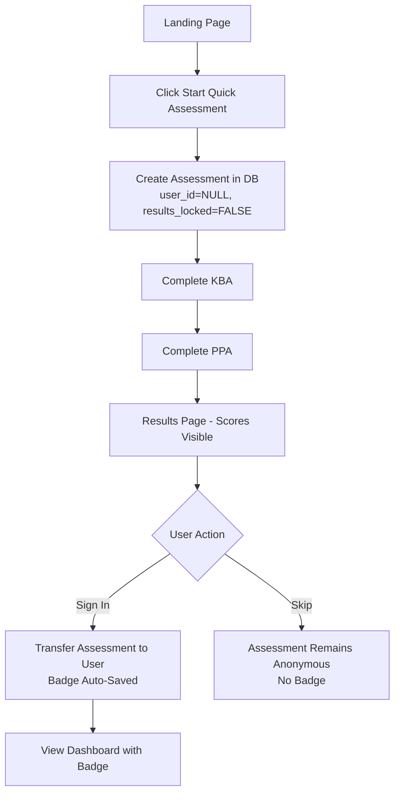
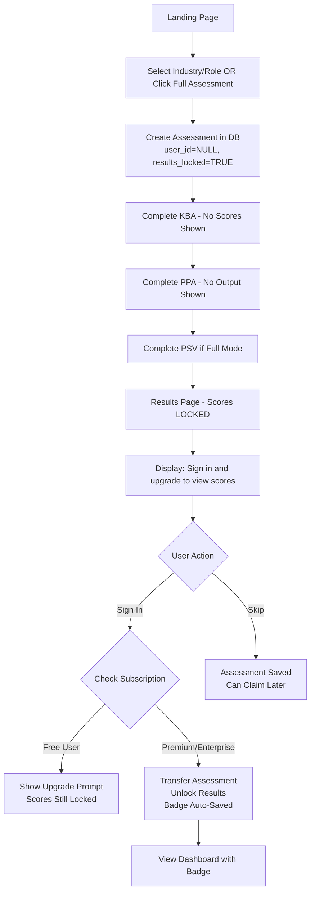
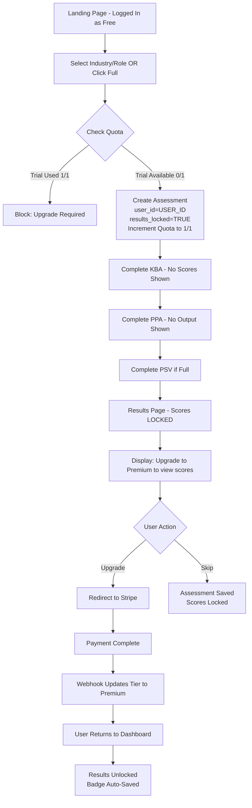
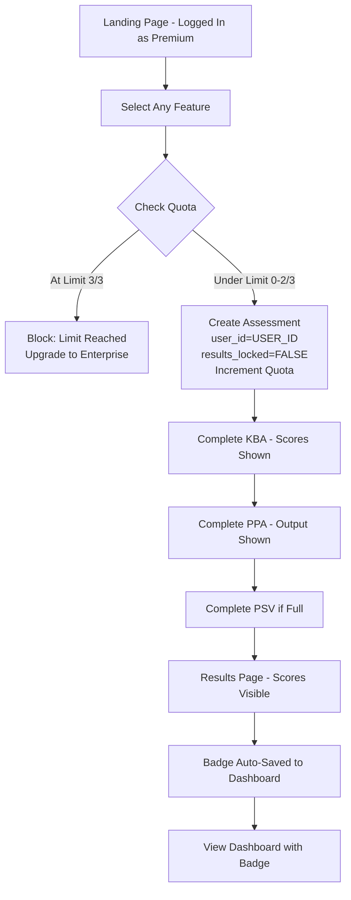
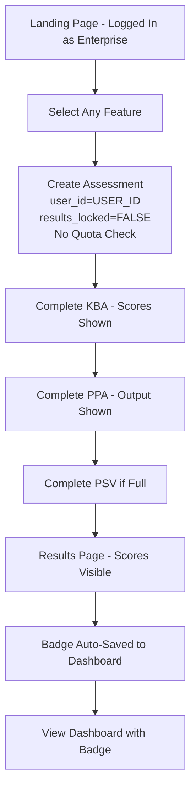

# Simplified User Conversion Journey - Phase 1

## Overview

This document outlines the Phase 1 simplification of the Promptranks user conversion flow. The goal is to reduce complexity from 7/10 to 5/10 by addressing three key areas:

1. **Database-backed state management** - Replace sessionStorage with database persistence
2. **Simplified premium gating** - Single decision point instead of multiple conditional checks
3. **Deferred badge claiming** - Lazy approach where badges appear automatically in dashboard

## Core Principles

### Anonymous-First Assessment Flow
- **All users (anonymous or authenticated) can START and COMPLETE any assessment**
- Premium features (industry/role selection, full mode) lock results until user subscribes
- Freemium features (quick assessment without industry/role) show results immediately
- Authentication is only required at the **Results page** to claim/view scores

### Quota Management
- **Quota consumed at assessment START** (not completion or claim)
- Free users: 1 trial for premium features
- Premium users: 3 assessments per month
- Enterprise users: unlimited

### Results Locking
- **Freemium features**: Results visible to all users (anonymous or authenticated)
- **Premium features**: Results locked until user signs in AND subscribes
- Locked results show: "Sign in and upgrade to Premium to view your scores"

---

## User Flows

### Flow 1: Anonymous User → Freemium Feature → Complete

**Scenario**: User starts quick assessment without selecting industry/role



**Key Points**:
- No authentication required at any step
- Scores visible immediately after completion
- Badge only saved if user signs in
- Anonymous assessments can be claimed later via OAuth state transfer

---

### Flow 2: Anonymous User → Premium Feature → Complete → Locked Results

**Scenario**: User selects industry/role or starts full assessment without authentication



**Key Points**:
- User can complete entire assessment without authentication
- Scores/outputs hidden during assessment (show "Upgrade to view" messages)
- Results page shows locked state with upgrade prompt
- If user signs in as free user, still locked until they upgrade
- If user signs in as premium/enterprise, results unlock immediately

---

### Flow 3: Authenticated Free User → Premium Feature → Locked Results

**Scenario**: Free user (already logged in) tries to start premium assessment



**Key Points**:
- Free users get 1 trial for premium features
- Quota consumed at START (not completion)
- If trial already used, blocked at start with upgrade prompt
- If trial available, can complete assessment but results locked
- After upgrade, all locked assessments unlock automatically

---

### Flow 4: Authenticated Premium User → Any Feature → Auto-Badge

**Scenario**: Premium user (already logged in) starts any assessment



**Key Points**:
- Premium users: 3 assessments per month
- Quota consumed at START
- All results visible immediately
- Badge auto-saved on completion
- No manual claiming needed

---

### Flow 5: Authenticated Enterprise User → Unlimited Access

**Scenario**: Enterprise user (already logged in) starts any assessment



**Key Points**:
- Enterprise users: unlimited assessments
- No quota checks
- All results visible immediately
- Badge auto-saved on completion

---

## Database Schema

### Table: assessments

```sql
CREATE TABLE assessments (
    id UUID PRIMARY KEY DEFAULT gen_random_uuid(),
    user_id UUID REFERENCES users(id) ON DELETE CASCADE,  -- NULL for anonymous
    mode VARCHAR(20) NOT NULL,  -- 'quick' or 'full'
    status VARCHAR(20) DEFAULT 'in_progress',
    results_locked BOOLEAN DEFAULT FALSE,  -- TRUE for premium features
    industry_id UUID REFERENCES industries(id),
    role_id UUID REFERENCES roles(id),
    
    -- Scores
    kba_score FLOAT,
    ppa_score FLOAT,
    psv_score FLOAT,
    final_score FLOAT,
    level INTEGER,
    pillar_scores JSONB,
    
    -- Timestamps
    started_at TIMESTAMP WITH TIME ZONE DEFAULT NOW(),
    completed_at TIMESTAMP WITH TIME ZONE,
    expires_at TIMESTAMP WITH TIME ZONE,
    
    -- Badge claiming
    badge_claimed BOOLEAN DEFAULT FALSE,
    badge_claimed_at TIMESTAMP WITH TIME ZONE,
    
    -- Assessment data
    kba_responses JSONB,
    ppa_responses JSONB,
    psv_responses JSONB
);
```

### Table: user_usage

```sql
CREATE TABLE user_usage (
    id UUID PRIMARY KEY DEFAULT gen_random_uuid(),
    user_id UUID REFERENCES users(id) ON DELETE CASCADE,
    period_start DATE NOT NULL,
    period_end DATE NOT NULL,
    full_assessments_used INTEGER DEFAULT 0,
    full_assessments_limit INTEGER DEFAULT 0,
    created_at TIMESTAMP WITH TIME ZONE DEFAULT NOW(),
    updated_at TIMESTAMP WITH TIME ZONE DEFAULT NOW(),
    
    UNIQUE(user_id, period_start)
);
```

---

## API Endpoints

### POST /assessments/start

**Request**:
```json
{
  "mode": "quick" | "full",
  "industry_id": "uuid" | null,
  "role_id": "uuid" | null
}
```

**Logic**:
1. Determine if premium features used: `mode == "full" OR industry_id != null OR role_id != null`
2. If premium features AND user authenticated:
   - Check quota (free: 1 trial, premium: 3/month, enterprise: unlimited)
   - If at limit: return 402/403 error
   - If under limit: increment quota
3. Create assessment with `results_locked = premium_features_used`
4. Return assessment_id

**Response**:
```json
{
  "assessment_id": "uuid",
  "mode": "quick" | "full",
  "results_locked": true | false
}
```

---

### POST /assessments/{id}/kba/submit

**No authentication required** - allows anonymous completion

**Logic**:
1. Score KBA answers
2. Save scores to assessment
3. If `results_locked == true`: return `{ "results_locked": true, "message": "..." }`
4. Else: return scores

**Response (unlocked)**:
```json
{
  "kba_score": 85.5,
  "total_correct": 17,
  "total_questions": 20,
  "pillar_scores": { ... }
}
```

**Response (locked)**:
```json
{
  "results_locked": true,
  "message": "KBA completed. Sign in and upgrade to Premium to view your scores."
}
```

---

### POST /assessments/{id}/ppa/execute

**No authentication required** - allows anonymous completion

**Logic**:
1. Execute prompt via LLM
2. Store attempt
3. If `results_locked == true`: return `{ "results_locked": true, "message": "..." }`
4. Else: return LLM output

**Response (unlocked)**:
```json
{
  "task_id": "uuid",
  "attempt_number": 1,
  "output": "LLM generated output...",
  "attempts_used": 1,
  "max_attempts": 3
}
```

**Response (locked)**:
```json
{
  "results_locked": true,
  "message": "Task completed. Sign in and upgrade to Premium to view results."
}
```

---

### GET /assessments/{id}/results

**Authentication optional** - returns locked state if applicable

**Response (unlocked)**:
```json
{
  "assessment_id": "uuid",
  "mode": "quick",
  "status": "completed",
  "results_locked": false,
  "final_score": 87.3,
  "level": 3,
  "kba_score": 85.5,
  "ppa_score": 89.1,
  "psv_score": null,
  "pillar_scores": { ... },
  "completed_at": "2026-04-04T10:30:00Z"
}
```

**Response (locked)**:
```json
{
  "assessment_id": "uuid",
  "mode": "full",
  "status": "completed",
  "results_locked": true,
  "final_score": 0,
  "level": 0,
  "kba_score": 0,
  "ppa_score": 0,
  "psv_score": 0,
  "pillar_scores": {},
  "completed_at": "2026-04-04T10:30:00Z"
}
```

---

### POST /assessments/{id}/claim

**Authentication required** - transfers anonymous assessment to user

**Logic**:
1. Verify assessment exists and is completed
2. Authenticate user (via token or email/password in body)
3. Transfer assessment: `assessment.user_id = user.id`
4. Generate badge
5. Mark `badge_claimed = true`
6. Return badge data

**Response**:
```json
{
  "badge_id": "uuid",
  "badge_svg": "<svg>...</svg>",
  "verification_url": "https://...",
  "token": "jwt_token",
  "user_id": "uuid"
}
```

---

### GET /auth/google?assessment_id={uuid}

**OAuth with assessment transfer**

**Logic**:
1. Encode `assessment_id` in OAuth state parameter
2. Redirect to Google OAuth
3. On callback: extract `assessment_id` from state
4. Transfer assessment to user: `assessment.user_id = user.id`
5. Return user data + token

---

## Frontend Implementation

### Landing.tsx

```typescript
const handleStartAssessment = async () => {
  const response = await fetch('/api/assessments/start', {
    method: 'POST',
    headers: {
      'Content-Type': 'application/json',
      ...(token && { 'Authorization': `Bearer ${token}` })
    },
    body: JSON.stringify({
      mode: selectedMode,
      industry_id: selectedIndustry,
      role_id: selectedRole
    })
  })

  if (response.status === 402) {
    // Free user, trial used - redirect to pricing
    navigate('/pricing')
    return
  }

  if (response.status === 403) {
    // Premium user at limit - show upgrade prompt
    setShowUpgradeModal(true)
    return
  }

  const data = await response.json()
  navigate(`/assessment/${data.assessment_id}`)
}
```

---

### Assessment.tsx

```typescript
// KBA submission
const handleSubmitKBA = async () => {
  const response = await fetch(`/api/assessments/${assessmentId}/kba/submit`, {
    method: 'POST',
    headers: { 'Content-Type': 'application/json' },
    body: JSON.stringify({ answers })
  })

  const data = await response.json()

  if (data.results_locked) {
    // Show inline message: "Sign in and upgrade to view scores"
    setLockedMessage(data.message)
  } else {
    // Show scores
    setKbaScore(data.kba_score)
  }

  // Continue to PPA
  setPhase('ppa')
}
```

---

### Results.tsx

```typescript
const ResultsPage = () => {
  const { assessmentId } = useParams()
  const [results, setResults] = useState(null)

  useEffect(() => {
    const fetchResults = async () => {
      const response = await fetch(`/api/assessments/${assessmentId}/results`)
      const data = await response.json()
      setResults(data)
    }
    fetchResults()
  }, [assessmentId])

  if (results.results_locked) {
    return (
      <div>
        <h2>Assessment Complete!</h2>
        <p>🔒 Sign in and upgrade to Premium to view your scores.</p>
        <button onClick={() => navigate(`/auth/google?assessment_id=${assessmentId}`)}>
          Sign In with Google
        </button>
        <button onClick={() => navigate('/pricing')}>
          View Pricing
        </button>
      </div>
    )
  }

  return (
    <div>
      <h2>Assessment Complete!</h2>
      <p>Your score: {results.final_score}</p>
      <p>Level: {results.level}</p>
      {isAuthenticated ? (
        <p>✓ Badge saved to your dashboard</p>
      ) : (
        <button onClick={() => navigate(`/auth/google?assessment_id=${assessmentId}`)}>
          Sign In to Save Badge
        </button>
      )}
    </div>
  )
}
```

---

## Benefits of This Approach

### 1. Frictionless Anonymous Experience
- Users can try the full assessment without creating an account
- No authentication barriers during assessment
- Conversion happens at the moment of value (seeing results)

### 2. Clear Value Proposition
- Free users see what they're missing (locked results)
- Premium features are gated at results, not at start
- Upgrade prompt appears when user is most motivated

### 3. Simplified Implementation
- No complex state management during assessment
- Single decision point for premium gating (at start)
- No mid-flow authentication checks

### 4. Better Conversion Funnel
- Anonymous → Complete → See Locked Results → Sign In → Upgrade
- User has already invested time, more likely to convert
- Clear path from free trial to paid subscription

---

## Implementation Checklist

### Backend
- [x] Remove ownership verification from assessment completion endpoints
- [x] Add `results_locked` field to assessments table
- [x] Implement quota check at assessment start
- [x] Return locked responses when `results_locked == true`
- [x] Add `assessment_id` parameter to OAuth endpoints
- [x] Transfer assessment on OAuth callback
- [ ] Update usage service to handle free user trial (1 attempt)
- [ ] Add webhook handler to unlock assessments on upgrade

### Frontend
- [ ] Update Landing.tsx to handle 402/403 responses
- [ ] Update Assessment.tsx to show locked messages
- [ ] Update Results.tsx to show locked state with upgrade prompt
- [ ] Pass `assessment_id` to OAuth login links
- [ ] Remove authentication checks from assessment flow
- [ ] Add upgrade prompts at results page

### Testing
- [ ] Test anonymous user freemium flow (no lock)
- [ ] Test anonymous user premium flow (locked results)
- [ ] Test free user premium flow (1 trial, then locked)
- [ ] Test premium user flow (3/month quota)
- [ ] Test enterprise user flow (unlimited)
- [ ] Test assessment transfer on OAuth login
- [ ] Test results unlock after upgrade

---

## Migration Strategy

1. **Deploy backend changes** - Remove auth checks, add results locking
2. **Deploy frontend changes** - Update UI to handle locked states
3. **Monitor conversion rates** - Track anonymous → authenticated → paid
4. **Iterate on messaging** - Optimize upgrade prompts based on data

---

## Success Metrics

- **Anonymous completion rate**: % of anonymous users who complete assessments
- **Sign-in conversion**: % of anonymous users who sign in after completion
- **Upgrade conversion**: % of free users who upgrade after seeing locked results
- **Trial usage**: % of free users who use their 1 trial for premium features
- **Premium retention**: % of premium users who stay subscribed month-over-month
